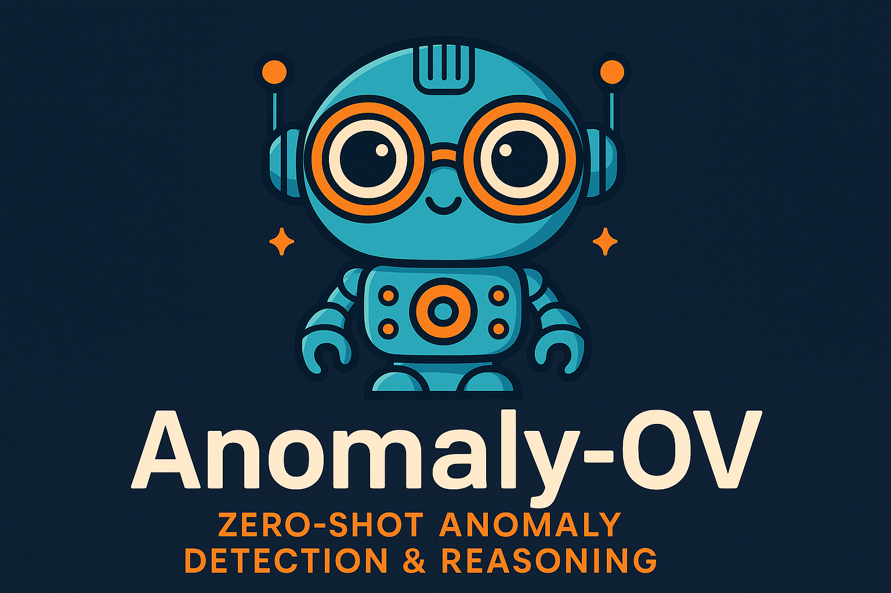

<p align="center" width="100%">

</p>

# Anomaly-OV (CVPR 2025 Highlight)
This is the official repository for our recent paper "Towards Zero-Shot Anomaly Detection and Reasoning with Multimodal Large Language Models".
[](https://arxiv.org/abs/2502.07601)
[](https://xujiacong.github.io/Anomaly-OV/)

## Release Notes
- **[2025/04/25] 🔥 Anomaly-OV** is released and open to access. The implementation code and the contributed visual instruction tuning dataset & benchmark can be downloaded now. Please
remember to cite the source papers of the raw datasets.

## Models & Dataset & Scripts

### Installation

#### 1. **Clone this repository and navigate to the Anomaly-OneVision folder:**
```bash
git clone https://github.com/honda-research-institute/Anomaly-OneVision.git
cd Anomaly-OneVision
```

#### 2. **Install the inference and training package:**
```bash
export CUDA_HOME=<your cuda home> # we use cuda-12.1
conda create -n anomaly_ov python=3.10 -y
conda activate anomaly_ov
pip install --upgrade pip  # Enable PEP 660 support.
pip install -e ".[train]"
pip install accelerate==0.29.3
pip install flash-attn==2.6.3 --no-build-isolation
pip install pynvml
```

### Dataset Download

- Please access the dataset and benchmark via our [project page](https://xujiacong.github.io/Anomaly-OV/).
- Check the [.yaml file](data/datasets.yaml) and download the extra data selected from [LLaVA-OneVision Data](https://github.com/LLaVA-VL/LLaVA-NeXT/tree/main/scripts/train#about-the-llava-onevision-data).
- Unzip the datasets inside the folder `data/` or `path-to-your-data/`.
- Make sure to modify the **json_path** inside `data/datasets.yaml`.

### Training
Make sure to modify the argument `cache_dir` inside `TrainingArguments` of `llava/train/train.py`, so that your machine has enough space to store the pretrained weights.
#### 1. Finetune Anomaly-OV-0.5B
```bash
bash scripts/train/finetune_anomalyov_05b.sh
```
#### 2. Finetune Anomaly-OV-7B
```bash
bash scripts/train/finetune_anomalyov_7b.sh
```

### Inference
#### 1. Testing detection performance on VisA-D&R
```bash
python scripts/eval/test_detection.py --model_checkpoint path_to_your_checkpoint --size 7b 
```
#### 2. Testing reasoning performance on VisA-D&R
```bash
python scripts/eval/test_reasoning.py --model_checkpoint path_to_your_checkpoint --size 7b
```
#### 3. Single-image (2D) Chatting
```bash
python scripts/eval/test_chat_single.py --model_checkpoint path_to_your_checkpoint --size 7b -i figs/stop_sign.png
```
#### 4. Multiview images (3D) Chatting (TBD)
```bash
python scripts/eval/test_chat_multi.py --model_checkpoint path_to_your_checkpoint --size 7b -i figs/bowl/
```

## Citation

If you find our paper or this repository useful for your research and applications, please cite our paper:
```bibtex
@article{xu2025towards,
  title={Towards Zero-Shot Anomaly Detection and Reasoning with Multimodal Large Language Models},
  author={Xu, Jiacong and Lo, Shao-Yuan and Safaei, Bardia and Patel, Vishal M and Dwivedi, Isht},
  journal={arXiv preprint arXiv:2502.07601},
  year={2025}
}
```
Please remember to cite the source papers for the datasets used in Anomaly-Instruct-125k and VisA-D&R:
```bibtex
@inproceedings{anomaly_shapenet,
  title={Towards Scalable 3D Anomaly Detection and Localization: A Benchmark via 3D Anomaly Synthesis and A Self-Supervised Learning Network},
  author={Li, Wenqiao and Xu, Xiaohao and Gu, Yao and Zheng, Bozhong and Gao, Shenghua and Wu, Yingna},
  booktitle={Proceedings of the IEEE/CVF Conference on Computer Vision and Pattern Recognition},
  pages={22207--22216},
  year={2024}
}
@inproceedings{real3d,
  title={Real3D-{AD}: A Dataset of Point Cloud Anomaly Detection},
  author={Jiaqi Liu and Guoyang Xie and ruitao chen and Xinpeng Li and Jinbao Wang and Yong Liu and Chengjie Wang and Feng Zheng},
  booktitle={Thirty-seventh Conference on Neural Information Processing Systems Datasets and Benchmarks Track},
  year={2023},
  url={https://openreview.net/forum?id=zGthDp4yYe}
}
@inproceedings{mvtec3d,
   title={The MVTec 3D-AD Dataset for Unsupervised 3D Anomaly Detection and Localization},
   url={http://dx.doi.org/10.5220/0010865000003124},
   DOI={10.5220/0010865000003124},
   booktitle={Proceedings of the 17th International Joint Conference on Computer Vision, Imaging and Computer Graphics Theory and Applications},
   publisher={SCITEPRESS - Science and Technology Publications},
   author={Bergmann, Paul and Jin, Xin and Sattlegger, David and Steger, Carsten},
   year={2022}
}
@inproceedings{mvtec,
  title={MVTec AD--A comprehensive real-world dataset for unsupervised anomaly detection},
  author={Bergmann, Paul and Fauser, Michael and Sattlegger, David and Steger, Carsten},
  booktitle={Proceedings of the IEEE/CVF conference on computer vision and pattern recognition},
  pages={9592--9600},
  year={2019}
}
@inproceedings{visa,
  title={Spot-the-difference self-supervised pre-training for anomaly detection and segmentation},
  author={Zou, Yang and Jeong, Jongheon and Pemula, Latha and Zhang, Dongqing and Dabeer, Onkar},
  booktitle={European Conference on Computer Vision},
  pages={392--408},
  year={2022},
  organization={Springer}
}
@inproceedings{bmad,
  title={Bmad: Benchmarks for medical anomaly detection},
  author={Bao, Jinan and Sun, Hanshi and Deng, Hanqiu and He, Yinsheng and Zhang, Zhaoxiang and Li, Xingyu},
  booktitle={Proceedings of the IEEE/CVF Conference on Computer Vision and Pattern Recognition},
  pages={4042--4053},
  year={2024}
}
```
## Acknowledgement

- [LLaVA-NeXT](https://github.com/LLaVA-VL/LLaVA-NeXT): the codebase we built upon, and our model are based on [LLaVA-OneVision](https://arxiv.org/abs/2408.03326). For any questions regarding setting up the environment, please refer to the issues in their repository. Thanks for their great work!
- [LLaVA-OneVision Data](https://github.com/LLaVA-VL/LLaVA-NeXT/tree/main/scripts/train#about-the-llava-onevision-data): Part of our training data is selected from the open-sourced instruction tuning data used by LLaVA-OneVision. The medical knowledge of Anomaly-OV is learned from the [LLaVA-Med](https://github.com/microsoft/LLaVA-Med).
